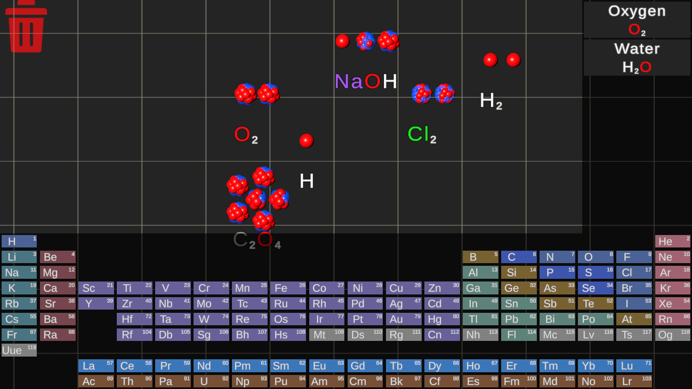

# Disclaimer

Ponieważ nie jesteśmy specjalistami w dziedzinie chemii, w aplikacji celowo zastosowano uproszczenia w obliczeniach chemicznych. Głównym celem stworzenia aplikacji i skupieniem się na jej rozwoju jest stworzenie rozszerzalnej platformy, do której w przyszłości, w razie potrzeby, można dodać wszelkie niezbędne funkcje, w tym usunięcie uproszczeń w obliczeniach wzorów chemicznych.

# Dopuszczone uproszczenia
## 1. Usunięto bilans pierwiastków w wzorach chemicznych.
Motywacja uproszczenia - przyspieszenie procesu tworzenia substancji poprzez usunięcie konieczności ręcznego dodawania duplikatów substancji do reakcji oraz usuwania zbędnych duplikatów produktów reakcji.

Przykład - formula "N2 + 3H2 -> 2NH3" zostaje przekształcona na "N2 + H2 -> NH3". W tym przypadku brakuje nam jednego "H" i mamy jeden nadmiarowy "N". Aplikacja automatycznie generuje brakujący element i usuwa nadmiarowy.

## 2. Liczba substancji wyjściowych we wszystkich reakcjach jest ograniczona do 2.
Motywacja uproszczenia: - przyspieszenie procesu tworzenia substancji poprzez uproszczenie go do przeciągania jednej substancji na drugą, co daje natychmiastowy wynik reakcji.
Ponieważ istnieje wystarczająco dużo reakcji chemicznych, w których występują tylko 2 substancje wyjściowe, nawet taki ograniczony funkcjonalny zestaw pozwala w pełni cieszyć się procesem tworzenia.

## 3. Katalizatory reakcji chemicznych zostały wyłączone.
Motywacja uproszczenia: przyspieszenie i ułatwienie procesu tworzenia substancji dla użytkowników słabo zaznajomionych z chemią poprzez eliminację konieczności dobierania obligatoryjnych katalizatorów na etapie tworzenia.
Konieczność dodania katalizatora wiąże się z koniecznością dodatkowych etapów mieszania substancji, co może zmniejszyć dynamikę aplikacji oraz utrudnić proces tworzenia nowych substancji dla użytkowników słabo zaznajomionych z niuansami chemii. 

## 4. Uproszczone dane wyświetlane o pierwiastkach chemicznych.
Przy najechaniu na pierwiastek układu okresowego, w panelu informacyjnym wyświetlane jest ograniczone zestawienie danych dotyczących tego pierwiastka.

Motywacja uproszczenia: celem panelu było pokazanie możliwości wyświetlenia różnych danych dotyczących pierwiastka, w tym modelu 3D struktury atomowej oraz fizycznego wyglądu. Ponieważ nie określono dokładnych specyfikacji aplikacji, lista danych wyświetlanych została wybrana według naszego uznania.

# Funkcjonalność aplikacji:

### 1. Przeglądanie informacji o pierwiastkach chemicznych:

### 2. Tworzenie elementów przez przeciąganie ich z układu okresowego:

### 3. Tworzenie nowych substancji poprzez przeciąganie jednej substancji na drugą:

### 4. Zapisywanie substancji na bocznym panelu w celu przyspieszenia tworzenia bardziej złożonych nowych substancji:

### 5. Anulowanie i powtórzenie sekwencji działań poprzez naciśnięcie odpowiednio klawiszy 1 i 2:

### 6. Usuwanie substancji poprzez przeciągnięcie ich na ikonę kosza:

### 7. Możliwość dodawania i usuwania listy obsługiwanych substancji chemicznych poprzez edycję pliku "compounds.json" (znajdującego się w folderze Assets w editorze Unity  lub w folderze zbudowanego projektu).

### 8. Możliwość dodawania i usuwania listy obsługiwanych reakcji chemicznych poprzez edycję pliku "reactions.json" (znajdującego się w folderze Assets w editorze Unity lub w folderze zbudowanego projektu).

Uwaga! Przy dodawaniu nowych reakcji chemicznych do pliku "reactions.json", upewnij się, że wszystkie substancje biorące udział w reakcji są również obecne w pliku "compounds.json". Jeśli brakuje przynajmniej jednej substancji, należy ją dodać, w przeciwnym razie reakcja nie będzie mogła się odbyć.
Aby wprowadzone zmiany zaczęły obowiązywać, konieczne jest ponowne uruchomienie aplikacji.

# Zarządzanie:
### 1.  Interakcja z substancją
Kliknięcie lewym przyciskiem myszy na substancji i przeciąganie kursora.

### 2. Przybliżanie i oddalanie panelu interakcji
Obracanie kółkiem myszy w kierunku siebie i od siebie odpowiednio.

### 3. Przesuwanie panelu interakcji
Przytrzymanie środkowego przycisku myszy (kółka) i przeciąganie kursorem. Alternatywnie - używanie strzałek (góra, dół, lewo, prawo) na klawiaturze.

### 4. Zapisywanie substancji na prawej paneli
Przeciągnięcie substancji, którą chcesz zapisać, na panel i zwolnienie lewego przycisku myszy.
Uwaga! Przeciąganie substancji składającej się z jednego elementu lub już obecnej na panelu będzie ignorowane.

### 5. Usuwanie substancji
Przeciągnij substancję na ikonę kosza i zwolnij lewy przycisk myszy.

### 6. UNDO (odwrócenie ostatniej akcji)
Naciśnij przycisk "1" (przycisk "1" na klawiaturze numerycznej nie jest brany pod uwagę).

### 7. REDO (przywrócenie ostatniej akcji)
Naciśnij przycisk "2" (przycisk "2" na klawiaturze numerycznej nie jest brany pod uwagę).

# Struktura projektu (główne istotne struktury)
## Encje :
### Element
Zawiera dane o chemicznym elemencie układu okresowego, pobrane z pliku "elements.json".
### Compound
Zawiera dane o chemicznej substancji, pobrane z pliku "compounds.json".
### Reaction
Zawiera dane o chemicznej reakcji, pobrane z pliku "reactions.json".
### DraggableCompound
Reprezentacja chemicznej substancji na panelu interakcji. Jest głównym elementem interakcji w aplikacji. Zawiera serię chemicznych elementów i nazwę substancji, która jest zbudowana z tych elementów. 
### DraggableCompoundElement
Reprezentacja elementu chemicznej substancji na panelu interakcji. Jest wizualizacją chemicznego elementu i składową częścią chemicznej substancji.

## Managers:
### EntryPoint
Jest to punkt wejścia do aplikacji. Odpowiada za inicjalizację aplikacji podczas uruchomienia oraz rozpoczęcie głównego cyklu życia aplikacji.
### MainManager
Odpowiada za wykonywanie głównego cyklu życia aplikacji oraz koordynację działań innych menadżerów i komponentów.
### ElementManager 
 Odpowiada za odczyt plików "elements.json", "compounds.json", "reactions.json", przekształcenie ich na odpowiednie encje oraz dostarczanie informacji o tych encjach.
### PeriodicTable
Odpowiada za inicjalizację, wizualizację i interakcję z układem okresowym pierwiastków.
### InputManager
Odpowiada za obsługę interakcji użytkownika.
### ActionHistoryManager
Odpowiada za przechowywanie historii działań użytkownika, ich cofanie (UNDO) i przywracanie (REDO).
### CompoundManager
Odpowiada za wszystkie operacje związane z substancjami na panelu interakcji:
- Tworzenie
- Przenoszenie
- Łączenie (sprawdzanie możliwości reakcji, walidacja danych z bazą, rekombinacja elementów)
- Usuwanie
